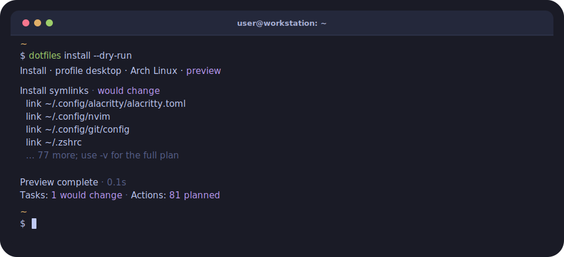

# Dotfiles

My personal dotfiles manager built around a **Rust CLI** and declarative TOML configuration. It keeps my Linux and Windows environments consistent across shell, editor, Git, packages, AI tooling and more.



## Core ideas

- **Cross-platform:** one Rust CLI plans and applies the desired machine state across Linux and Windows.
- **Profile-aware:** choose `base` or `desktop`; the CLI automatically applies config for the current machine's platform.
- **Declarative:** TOML files describe packages, links, tools, and settings without turning setup into a collection of one-off scripts.
- **Idempotent:** re-running `install` converges on the declared state. Preview changes first with `-d`.

## Commands

Bootstrap with the platform wrapper: `./dotfiles.sh install` on Linux or
`.\dotfiles.ps1 install` on Windows. The wrapper downloads the latest release
when no binary is present; add `--build` to compile from source instead. After
bootstrap, use the installed `dotfiles` command.

For a first run, preview the selected profile before applying it:

```bash
./dotfiles.sh install -p desktop -d
```

| Task | Command |
|------|---------|
| Apply config | `dotfiles install` |
| Preview changes | `dotfiles install -d` |
| Update dependencies | `dotfiles update` |
| Detach managed files | `dotfiles uninstall` |
| Validate config | `dotfiles test` |
| Inspect logs | `dotfiles log` |
| Show version | `dotfiles --version` |

Use `install` for normal repeatable convergence. Use `update` only when you
also want to advance pinned dependency versions. `uninstall` detaches managed
links/hooks/wrappers, materializes symlinks, and leaves broader machine state
alone.

See the [Usage Guide](docs/USAGE.md) for the full command reference.

## Profiles

Each machine uses one profile; `linux`, `windows`, and `arch` are detected automatically and combined with the selected profile. Select a profile with `-p, --profile`:

```bash
dotfiles install -p desktop
```

If no profile is set, `install` prompts for one and saves the selection for future runs.

| Profile | Best for |
|---------|----------|
| `base` | Servers, WSL, minimal shell environments |
| `desktop` | Full desktop/workstation setups with GUI tools |

See the [Profile System Guide](docs/PROFILES.md) for details.

## Configuration

Declarative settings are stored in `conf/*.toml`. Edit these files and the CLI applies the requested state. The table below highlights the core configuration files; it is not a complete list:

| File | Controls |
|------|----------|
| `profiles.toml` | Profile definitions |
| `manifest.toml` | Files included for each profile/platform |
| `symlinks.toml` | Files linked into `$HOME` |
| `packages.toml` | Packages for pacman, AUR, or winget |
| `git-config.toml` | Git settings |
| `registry.toml` | Windows registry keys |

See the [Configuration Reference](docs/CONFIGURATION.md) for the full TOML format.

## Development

Run Rust development commands from the `cli/` directory:

```bash
cargo build                      # build
cargo test                       # unit + integration tests
cargo clippy -- -D warnings      # lint
cargo fmt                        # format
```

From the repo root, build from source and preview changes against the active config:

```bash
./dotfiles.sh --build install -d # run from repo root
```

## Documentation

| Guide | What's in it |
|-------|--------------|
| [Documentation Index](docs/README.md) | All project guides by topic |
| [Usage Guide](docs/USAGE.md) | All commands and flags |
| [Task Reference](docs/TASKS.md) | Every install, update, uninstall, validation, and overlay task |
| [Profile System](docs/PROFILES.md) | How profiles work |
| [Configuration Reference](docs/CONFIGURATION.md) | TOML format details |
| [Architecture](docs/ARCHITECTURE.md) | Rust CLI design |
| [APM Tooling](docs/APM.md) | AI tooling packages and APM flow |
| [Contributing](docs/CONTRIBUTING.md) | Development workflow |
