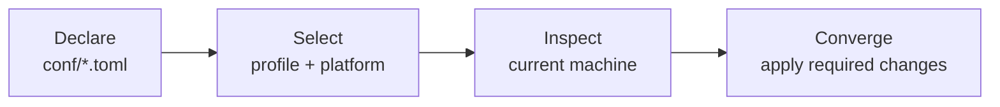

<h1 align="center">Dotfiles</h1>

  <strong>Keep Linux and Windows machines configured with a Rust CLI and declarative TOML.</strong>

  
  
  
  

  <a href="#quick-start">Quick start</a>
  &nbsp;&middot;&nbsp;
  <a href="docs/USAGE.md">Usage</a>
  &nbsp;&middot;&nbsp;
  <a href="docs/CONFIGURATION.md">Configuration</a>
  &nbsp;&middot;&nbsp;
  <a href="docs/ARCHITECTURE.md">Architecture</a>
  &nbsp;&middot;&nbsp;
  <a href="docs/CONTRIBUTING.md">Contributing</a>

  The CLI inspects the current machine and applies only the changes needed to match the selected profile.

  

## Quick start

From a repository checkout, preview the changes before applying them:

| Linux | Windows |
|:------|:--------|
| `./dotfiles.sh install --profile base --dry-run` | `.\dotfiles.ps1 install --profile desktop --dry-run` |
| `./dotfiles.sh install --profile base` | `.\dotfiles.ps1 install --profile desktop` |

The wrappers download and verify a compatible release binary when needed. Pass
`--build` to compile from source. After installation, run `dotfiles` directly.

> [!TIP]
> Commands that make changes accept `-d, --dry-run`, so the same workflow can
> be inspected before it is applied.

## How it works

```mermaid
flowchart LR
    config["Declare<br/>conf/*.toml"]
    context["Select<br/>profile + platform"]
    inspect["Inspect<br/>current machine"]
    converge["Converge<br/>apply required changes"]

    config --> context --> inspect --> converge
```

The selected profile and detected platform determine the active configuration.
Resources inspect the current machine, compare it with the desired state, and
make only the changes required to converge.

## What it manages

| Area | Managed state |
|------|---------------|
| Shell | Zsh and Bash configuration, login shell, `PATH`, and completions |
| Editors | Neovim, Vim, VS Code, and VS Code extensions |
| Terminal | Alacritty, tmux, and readline configuration |
| Git | Global settings and repository hooks |
| Packages | pacman and AUR packages via `paru` on Arch; winget packages on Windows |
| Linux desktop | Hyprland, Waybar, mako, fuzzel, gammastep, and GTK configuration |
| Services | systemd user and system units, including maintenance timers |
| SSH and GnuPG | Configuration files with enforced Unix file modes |
| AI tooling | APM packages and plugins, plus Copilot and Codex settings |
| Windows | Current-user registry values, Developer Mode, and WSL configuration |

Desired state lives in `conf/*.toml`. See the
[Configuration Reference](docs/CONFIGURATION.md) for the file formats and the
[Task Reference](docs/TASKS.md) for the tasks behind these areas.

## CLI at a glance

### Commands

| Command | What it does |
|---------|--------------|
| `dotfiles install` | Applies the configured machine state |
| `dotfiles update` | Runs installation and advances pinned dependency versions |
| `dotfiles uninstall` | Materializes managed symlinks and removes hooks and the launcher |

Use `install` for normal setup and maintenance. Use `update` only when you want
pinned dependency versions to move forward. `uninstall` leaves packages,
services, and registry values in place.

### Profiles

| Profile | Use it for |
|---------|------------|
| `base` | Core setup for servers, WSL, and command-line environments |
| `desktop` | Core setup plus desktop apps and services |

Pass `--profile` or `-p` to choose one. Otherwise, `install` prompts and saves
the selection. The CLI automatically activates the `linux`, `windows`, and
`arch` categories that match the machine.

## Documentation

| Guide | Purpose |
|-------|---------|
| [Usage](docs/USAGE.md) | Bootstrap the CLI and use its commands and global options |
| [Configuration](docs/CONFIGURATION.md) | Edit the declarative TOML desired state |
| [Profiles](docs/PROFILES.md) | Configure role-specific and platform-specific behavior |
| [Architecture](docs/ARCHITECTURE.md) | Understand the CLI layers, task engine, and resource model |
| [Troubleshooting](docs/TROUBLESHOOTING.md) | Diagnose bootstrap and convergence failures |
| [Contributing](docs/CONTRIBUTING.md) | Build, test, and change the project |

The complete documentation index is available in [`docs/`](docs/README.md).
