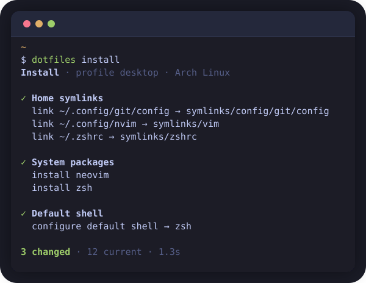

# Dotfiles

A Rust CLI that manages my Linux and Windows dotfiles from declarative TOML
configuration. Each run compares the machine with the configured state and
applies only the changes it needs.



## Quick start

From a repository checkout, preview the changes before applying them:

**Linux**

```bash
./dotfiles.sh install --profile base --dry-run
./dotfiles.sh install --profile base
```

**Windows**

```powershell
.\dotfiles.ps1 install --profile desktop --dry-run
.\dotfiles.ps1 install --profile desktop
```

The wrappers download and verify a compatible release binary when needed. Pass
`--build` to compile from source. After installation, run `dotfiles` directly.

## What it manages

The selected profile and detected platform determine which entries apply.

| Area | Managed state |
|------|---------------|
| Shell | Zsh and Bash configuration, login shell, `PATH`, and completions |
| Editors | Neovim, Vim, VS Code, and VS Code extensions |
| Terminal | Alacritty, tmux, and readline configuration |
| Git | Global settings and repository hooks |
| Packages | pacman and AUR packages via `paru` on Arch; winget packages on Windows |
| Linux desktop | Hyprland, Waybar, mako, fuzzel, gammastep, and GTK configuration |
| Services | systemd user and system units, including maintenance timers |
| SSH and GnuPG | Configuration files with enforced Unix file modes |
| AI tooling | APM packages and plugins, plus Copilot and Codex settings |
| Windows | Current-user registry values, Developer Mode, and WSL configuration |

See the [Task Reference](docs/TASKS.md) for the tasks behind these areas.

Desired state lives in `conf/*.toml`. See the
[Configuration Reference](docs/CONFIGURATION.md) for the file formats.

## Commands

| Command | What it does |
|---------|--------------|
| `dotfiles install` | Applies the configured machine state |
| `dotfiles update` | Runs installation and advances pinned dependency versions |
| `dotfiles uninstall` | Removes managed integrations while preserving user files |
| `dotfiles test` | Validates configuration and runs available script analyzers |
| `dotfiles tasks` | Lists task selectors and which commands use each task |
| `dotfiles log` | Reads retained run logs |

Use `install` for normal setup and maintenance. Use `update` only when you want
pinned dependency versions to move forward. `uninstall` leaves packages,
services, and registry values in place. Commands that make changes accept
`-d, --dry-run` to report changes without applying them.

See the [Usage Guide](docs/USAGE.md) for the full command reference.

## Profiles

Each machine uses one profile. The CLI adds the detected `linux`, `windows`, and
`arch` categories automatically.

```bash
dotfiles install -p desktop
```

If no profile is set, `install` prompts for one and saves the choice.

| Profile | Best for |
|---------|----------|
| `base` | Servers, WSL, minimal shell environments |
| `desktop` | Workstations with GUI tools |

See the [Profile System Guide](docs/PROFILES.md) for details.

For platform guides, troubleshooting, architecture, and development workflows,
see the [documentation index](docs/README.md).
