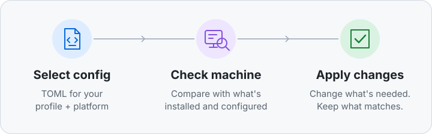

<h1 align="center">Dotfiles</h1>

<p align="center">
  <strong>My Arch Linux and Windows setup, managed by a Rust CLI.</strong>
</p>

<p align="center">
  <a href="https://github.com/sneivandt/dotfiles/actions/workflows/ci.yml"></a>
  <a href="https://github.com/sneivandt/dotfiles/releases/latest"></a>
  <a href="LICENSE"></a>
</p>

<p align="center">
  <a href="docs/USAGE.md">CLI</a>
  &nbsp;&middot;&nbsp;
  <a href="docs/CONFIGURATION.md">Config</a>
  &nbsp;&middot;&nbsp;
  <a href="docs/ARCHITECTURE.md">Arch</a>
  &nbsp;&middot;&nbsp;
  <a href="docs/CONTRIBUTING.md">Contribute</a>
</p>

Packages, symlinks, and system settings live in TOML files. Choose a profile
and preview it with `--dry-run`. Run `dotfiles install` to apply the changes;
it checks the machine first and skips anything that already matches.

<p align="center">
  
</p>

## Scope

I use these dotfiles on my own machines. Borrow individual configs or adapt
the whole setup, but read through the package lists and settings before
installing them.

The CLI installs packages through pacman and the AUR on Arch Linux, and winget
on Windows. Shell and file configuration also works on other Linux distributions.

## What it manages

Your profile and operating system determine which settings apply.

| Area | Included configuration |
|---|---|
| Shell | Zsh, Bash, PowerShell, tmux, `PATH`, and completions |
| Editors | Vim/Neovim, VS Code settings, and extensions |
| Terminal | Alacritty and Windows Terminal |
| Git | Global settings, aliases, and repository hooks |
| Packages | pacman and AUR packages via `paru`; winget packages on Windows |
| Arch desktop | Hyprland, Quickshell, mako, fuzzel, and GTK settings |
| Services | systemd user and system units |
| AI tooling | APM packages and plugins, Copilot and Codex settings |
| Windows | Current-user registry values and Developer Mode |

## Quick start

You'll need Git, plus `curl` or `wget` on Linux. On Windows, run the commands
in PowerShell. You only need Rust to build from source.

Clone into a folder you intend to keep. The installed symlinks point back to it.

```sh
git clone https://github.com/sneivandt/dotfiles.git
cd dotfiles
```

To keep your own changes, clone a fork and edit
[make it yours](#make-it-yours) before continuing.

### Profiles

| Profile | Use it for |
|---|---|
| `base` | Shell tools and core configuration for servers, WSL, and command-line environments |
| `desktop` | The core setup plus GUI apps and desktop services |

Both profiles work on Linux and Windows. The CLI detects the operating system.
Choose a profile with `--profile`; if none is selected or saved, `install`
asks and remembers your answer. See [Profiles](docs/PROFILES.md) for details.

### Linux

Preview the `base` profile:

```bash
./dotfiles.sh install --profile base --dry-run
```

Review the output, then apply it:

```bash
./dotfiles.sh install --profile base
```

For an Arch workstation, use `--profile desktop` in both commands.

### Windows

Preview the `desktop` profile:

```powershell
.\dotfiles.ps1 install --profile desktop --dry-run
```

Review the output, then apply it:

```powershell
.\dotfiles.ps1 install --profile desktop
```

See the [Windows guide](docs/WINDOWS.md) for winget, symlinks, and elevation.

Both scripts download the CLI when needed and verify its SHA-256 checksum.
When `gh` is installed, they also verify that GitHub built the download for
this repository. Downloads are available for Linux x86-64 and ARM64, and
Windows x86-64. Pass `--build` to compile from your checkout instead.
See [Bootstrap](docs/USAGE.md#bootstrap) for verification and update details.

## CLI at a glance

After installation, open a new shell and use `dotfiles` directly.

| Command | What it does |
|---------|--------------|
| `dotfiles install` | Syncs the repository and applies the selected configuration |
| `dotfiles install --update-pins` | Installs the configuration and updates pinned dependencies |
| `dotfiles uninstall` | Replaces managed symlinks with local copies and removes managed hooks and the launcher |
| `dotfiles check` | Checks configuration and runs available script analyzers |
| `dotfiles tasks` | Lists task selectors and the commands that run them |
| `dotfiles profiles` | Lists configured role profiles |
| `dotfiles log` | Shows saved run logs |

Run `install` after changing your configuration. Add `--no-repo-update` to
use your current checkout without syncing the repository.

To work on just the symlinks:

```sh
dotfiles tasks --profile desktop
dotfiles install --only symlinks --dry-run
dotfiles install --only symlinks
```

Add `--with-deps` to run the selected tasks' prerequisites too. See
[task selection](docs/USAGE.md#select-tasks) for details.

`uninstall` leaves packages, services, and registry values in place.
Preview it with `dotfiles uninstall --dry-run`.

## Make it yours

- [conf/packages.toml](conf/packages.toml) selects packages by platform and role.
- [conf/profiles.toml](conf/profiles.toml) defines roles and their included or
  excluded categories.
- [conf/symlinks.toml](conf/symlinks.toml) maps files under [symlinks/](symlinks/)
  into your home directory. Edit those source files to change app settings.
- The remaining [conf/](conf/) files declare Git settings, services, registry
  values, permissions, extensions, and agent settings.

For example, `[arch-desktop]` entries apply only when both `arch` and `desktop`
are active. The [configuration guide](docs/CONFIGURATION.md) explains section
matching and each file format.

Keep private additions in a separate repository and pass `--overlay <PATH>`.
The CLI adds overlay entries to the public configuration without replacing
matching records. See [Overlays](docs/CONFIGURATION.md#overlays) for details.

After editing, run `dotfiles check`, then preview with
`dotfiles install --dry-run --no-repo-update`.

## How it works

<p align="center">
  
</p>

The CLI selects the TOML entries for your profile and operating system, then
compares them with the machine. It applies the changes in dependency order;
tasks that don't depend on each other can run together. With `--dry-run`, it
reports the planned changes without applying them.

See [Architecture](docs/ARCHITECTURE.md) for the code structure and
[Task reference](docs/TASKS.md) for what each command runs.

## Documentation

| Guide | Purpose |
|-------|---------|
| [Usage](docs/USAGE.md) | Command options, task selection, logs, and updates |
| [Configuration](docs/CONFIGURATION.md) | TOML formats, category matching, and private overlays |
| [Troubleshooting](docs/TROUBLESHOOTING.md) | Bootstrap failures, skipped tasks, and configuration problems |
| [Contributing](docs/CONTRIBUTING.md) | Development setup and the change workflow |
| [Testing](docs/TESTING.md) | Local checks and CI coverage |

The [documentation index](docs/README.md) also links to all other documentation.