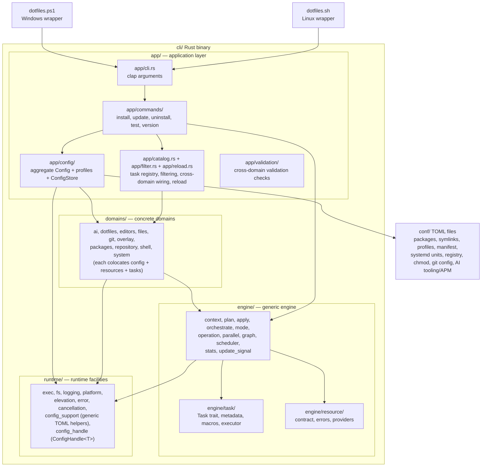

# Architecture

Technical documentation covering the implementation and design of the dotfiles management system.

## Overview

This dotfiles project is a cross-platform, profile-based configuration management system built around a **Rust core engine** (`cli/`). Thin shell wrappers (`dotfiles.sh` on Linux, `dotfiles.ps1` on Windows) download or build the binary and forward all arguments to it. Configuration lives in declarative TOML files (`conf/`), and the binary handles parsing, profile resolution, platform detection, and task execution.

## Design Principles

### 1. Cross-Platform Compatibility

**Challenge**: Support both Linux (Arch, Debian, etc.) and Windows with a unified configuration approach.

**Solution**:
- Single Rust binary compiled for both platforms
- Thin platform-native entry points (`dotfiles.sh`, `dotfiles.ps1`) that download or build the binary
- Shared configuration format (TOML files in `conf/`)
- Compile-time platform detection via `cfg!(target_os)` plus runtime checks (e.g. `/etc/arch-release`)
- Profile system to exclude platform-specific files and configuration

### 2. Idempotency

**Challenge**: Allow the tool to be run multiple times safely.

**Solution**:
- Every task checks existence/state before acting
- Operations that are already complete are skipped
- Skipped operations are logged in verbose mode
- No side effects on re-runs

### 3. Profile-Based Configuration

**Challenge**: Support multiple environments (headless server, desktop, Windows) from one repository.

**Solution**:
- Profile definitions in `conf/profiles.toml` map to category exclusions
- Git sparse checkout excludes files by category
- TOML table names carry category tags; the binary filters them against the active profile
- Automatic OS detection provides safety overrides

### 4. Binary Distribution

**Challenge**: End users should not need a Rust toolchain installed.

**Solution**:
- GitHub Actions builds release binaries whenever a CI run on `main` completes successfully
- The release workflow (`.github/workflows/release.yml`) publishes Linux (x86_64, aarch64) and Windows binaries with SHA-256 checksums
- The shell wrappers bootstrap the latest release when the binary is missing; the Rust binary owns the one-hour latest-release cache (`bin/.dotfiles-version-cache`)
- A `--build` flag builds from source for development

## High-Level Architecture

The crate is organized into four layers with a strict dependency direction:
`app` may depend on everything; `domains` depend on `engine` and `runtime`;
`engine` depends on `runtime`; `runtime` depends only on `std` and external
crates. `engine` and `runtime` never import `app` or `domains`.
The feature-gated `testing` facade is not a production layer; it preserves
stable integration-test access while forwarding to the new internal modules.



## Component Architecture

### Shell Wrappers

#### `dotfiles.sh` (Linux)

POSIX shell script that:
- Checks for a `--build` flag; if set, runs `cargo build --profile dev-opt` in `cli/` and executes the resulting binary
- Otherwise, bootstraps the latest published binary when `bin/dotfiles` is missing
- Verifies the downloaded bootstrap binary with the published SHA-256 checksum
- Exports `DOTFILES_ROOT` and forwards the remaining arguments directly to the binary

#### `dotfiles.ps1` (Windows)

PowerShell script with identical logic:
- `--build` flag builds from source with `cargo build --profile dev-opt`
- Otherwise bootstraps `dotfiles-windows-x86_64.exe` from GitHub Releases when missing
- Verifies checksum, promotes any staged self-update before launch, and exports `DOTFILES_ROOT`
- Forwards all other arguments directly to the binary

### Rust Core (`cli/`)

The binary is built with `cargo` from `cli/Cargo.toml`. Key dependencies:

- **clap** — CLI argument parsing with derive macros
- **anyhow** — error handling and context propagation

#### Entry Point (`main.rs` / `lib.rs`)

`main.rs` delegates to the public `dotfiles_cli::run` entry point in `lib.rs`,
which forwards to `app::run::run`. That function parses CLI arguments via
`app::cli::Cli`, creates a `Logger`, sets up cancellation and elevation, and
dispatches to the matching command handler.

#### CLI (`app/cli.rs`)

Defines the command structure using clap derive:

```
dotfiles [-v] [-p PROFILE] [-d] [--no-parallel] [--root DIR] <COMMAND>

Commands:
  install     Install dotfiles and configure system
  update      Install and advance pinned dependency versions
  uninstall   Materialize managed symlinks and remove hooks/wrappers
  test        Run self-tests and validation
  version     Print version information

Install/update options:
  --skip TASK,...   Skip specific tasks
  --only TASK,...   Run only specific tasks
```

The wrapper scripts (`dotfiles.sh` / `dotfiles.ps1`) handle only the `--build` flag and then forward all remaining arguments to the binary unchanged. All binary flags — including `-p`, `-d`, `-v`, `--skip`, `--only`, `--root`, and `--no-parallel` — are available when invoking via the wrappers.

#### Commands (`app/commands/`)

- **`install.rs`** — Uses `CommandRunner` to resolve the profile, load `Config`, build the task list, filter by `--skip`/`--only`, and execute the phased task pipeline. Before the task graph, it may self-update the binary and re-exec so the rest of the run uses the latest engine. It also attempts safe fast-forward-only repository synchronization in the task graph but leaves pinned dependency versions untouched. Exposes `run_pipeline(RunMode)`, the shared implementation behind both `install` and `update`
- **`update.rs`** — Delegates to `install::run_pipeline` with `RunMode::Update`, so it runs the same base task graph as `install` and additionally schedules the final Update phase to advance pinned dependency versions (currently the APM dependency refresh)
- **`uninstall.rs`** — Conservatively removes detachable managed state: symlinks, installed Git hooks, and the wrapper entry point. It intentionally does not remove packages or roll back registry, systemd, shell, editor, AI tooling/APM, WSL, or overlay-script changes
- **`test.rs`** — Runs configuration validation

#### Config (`app/config/` + `domains/<domain>/config/`)

The aggregate `Config` struct and its `Config::load()` composition live in
`app/config/`, alongside `profiles.rs`. Each domain owns its own config model
under `domains/<domain>/config/`; generic TOML parsing helpers live in
`runtime/config_support/`. `Config::load()` reads all TOML files from `conf/`
and filters sections against the active profile's categories:

| Module | File | Description |
| --- | --- | --- |
| `app/config/profiles.rs` | `profiles.toml` | Profile resolution and category computation |
| `runtime/config_support/toml_loader.rs` | (all) | Generic TOML loader |
| `domains/packages/config/packages.rs` | `packages.toml` | System packages (pacman, AUR, winget) |
| `domains/files/config/symlinks.rs` | `symlinks.toml` | Symlink mappings |
| `domains/system/config/systemd_units.rs` | `systemd-units.toml` | Systemd units (Linux only) |
| `domains/files/config/chmod.rs` | `chmod.toml` | File permissions |
| `domains/editors/config/vscode_extensions.rs` | `vscode-extensions.toml` | VS Code extensions |
| `domains/system/config/registry.rs` | `registry.toml` | Windows registry entries |
| `domains/git/config/git_config.rs` | `git-config.toml` | Git configuration settings |
| `domains/ai/config/copilot.rs` | `copilot.toml` | Copilot CLI settings (`~/.copilot/settings.json`) |
| `domains/repository/config/manifest.rs` | `manifest.toml` | Sparse checkout file mappings |
| `domains/overlay/config/overlay.rs` | — | Overlay path resolution and persistence |
| `domains/overlay/config/scripts.rs` | `scripts.toml` | Custom script entries from overlay repo |

#### Tasks (`engine/task/` + `domains/<domain>/tasks/`)

The generic `Task` trait, task metadata vocabulary, macros, and executor live in
`engine/task/`; concrete task implementations live under
`domains/<domain>/tasks/`. Each task implements the `Task` trait:

```rust
pub trait Task: Send + Sync + 'static {
    /// Human-readable task name.
    fn name(&self) -> &str;

    /// Which phase this task belongs to
    /// (Bootstrap, Sync, Provision, Validation, or Update).
    ///
    /// This is per-task metadata returned by the task itself — it is **not**
    /// derived from the folder the task lives in. A task can therefore live in
    /// any module yet declare any phase, which is how a single domain (e.g.
    /// the overlay system) can span more than one phase.
    fn phase(&self) -> TaskPhase;

    /// Stable identifier for dependency matching.
    fn task_id(&self) -> TaskId { TaskId::Type(TypeId::of::<Self>()) }

    /// TaskIds of tasks that must complete before this one starts.
    fn dependencies(&self) -> &[TaskId] { &[] }

    /// Declarative rules enforced before the task runs.
    fn execution_policies(&self) -> &[ExecutionPolicy] { ALWAYS_POLICY }

    /// Whether this task should run on the current platform/profile.
    fn should_run(&self, ctx: &Context) -> bool;

    /// Execute only when the task has configured work.
    fn run_configured(&self, ctx: &Context) -> Result<Option<TaskResult>>;

    /// Predict whether an applicable task will need elevation.
    fn needs_elevation(&self, ctx: &Context) -> bool { false }

    /// Execute the task.
    fn run(&self, ctx: &Context) -> Result<TaskResult>;
}
```

A shared `Context` struct (defined in `engine/context.rs`) carries only generic
execution and path state: repository and home paths, optional overlay path,
platform, executor, logger, cancellation token, and execution flags. It does
**not** carry the aggregate `Config`: the engine depends on `runtime` only and
must not know about the application configuration type.

Configuration reaches tasks through typed handles instead. The application layer loads the aggregate `Config`, splits it into one `runtime::ConfigHandle<T>` per domain slice (`app/config/store.rs`'s `ConfigStore`), and injects each handle into the task that needs it via that task's constructor (for example `InstallSymlinks::new(store.symlinks.clone())`). A `ConfigHandle<T>` is a cheaply-cloneable `Arc<RwLock<Arc<T>>>`; the app-owned `ReloadConfig` task (`app/reload.rs`) re-loads configuration after a pull and swaps every handle in place, so downstream tasks observe the new values without being rebuilt. App-only validation tasks hold a `ConfigHandle<Config>` for the whole aggregate.

Other task-specific dependencies are injected the same way: `UpdateRepository` and `ReloadConfig` share an `UpdateSignal` (`engine/update_signal.rs`) to coordinate config reloading, and hook tasks (`InstallGitHooks`, `UninstallGitHooks`) hold an `Arc<dyn FileSystemOps>` for testable filesystem access.

Cross-domain ordering constraints are **not** declared inside domains (which may name only same-domain tasks). Instead the application catalog (`app/catalog.rs`) wraps a task in `engine::TaskWithExtraDeps` to merge the extra dependency `TaskId`s — for example making `ConfigureSystemd` depend on `InstallSymlinks`, or `GenerateCompletions` depend on `UpdateRepository`. The decorator forwards the inner task's identity and behaviour unchanged, so tasks that depend on the wrapped task by type still resolve.

The `execute()` function owns the canonical applicability path: it evaluates
`execution_policies()`, checks `should_run()` once, and then calls
`run_configured()`. The configured-work hook can return `None` for an empty
configuration without re-evaluating policy or guards. The executor records
`Ok`, `NotApplicable`, `Skipped`, `DryRun`, or `Failed` in the logger. Before
parallel phase dispatch, `run_tasks_to_completion()` uses the same applicability
decision before priming sudo for tasks that predict a privileged mutation.

#### Engine (`engine/`)

The execution engine provides the generic resource processing loop, dependency graph, and shared context used by all tasks. Key components:

- **`context.rs`** — `Context` and `ContextOpts`: generic paths, platform,
  executor, logger, cancellation, and execution flags threaded through tasks
- **`plan.rs`** — pure resource plan/diff construction from `ResourceState` + `ProcessOpts`
- **`apply.rs`** — single-resource plan execution with one shared mutation lifecycle for apply/remove: log/dry-run → mutate → stats
- **`orchestrate.rs`** — top-level resource orchestration with `process_resources()`, `process_resources_with_provider()`, and `process_resources_remove()`
- **`mode.rs`** — `ProcessMode` enum (`Strict`, `Lenient`, `InstallMissing`, `FixExisting`) and `ProcessOpts` that control which states are fixable and whether errors bail or warn
- **`operation.rs`** — checkable, idempotent multi-step operations whose state
  check produces the immutable plan consumed by preview or apply
- **`parallel.rs`** — Rayon-based parallel dispatch when `ctx.parallel` is true
- **`graph.rs`** — phase-local dependency graph resolution, duplicate-ID checks,
  and one cached dependency-safe order produced by Kahn's algorithm
- **`scheduler.rs`** — dependency-driven parallel task scheduling using OS threads and `mpsc` channels
- **`stats.rs`** — `TaskResult` and `TaskStats` types
- **`task/`** — the generic `Task` trait, task metadata (`TaskPhase`, `Domain`, `TaskId`), task/resource macros, and the `execute()` runner
- **`resource/`** — the generic `Resource`/`IntrinsicState` contract
  (`contract.rs`), typed resource errors (`error.rs`), and state providers
  (`provider.rs`)
- **`update_signal.rs`** — `UpdateSignal` (backed by a `runtime::atomic_flag::AtomicFlag`) signalling between `UpdateRepository` and `ReloadConfig`

The cooperative `CancellationToken` and its backing `AtomicFlag` are generic
concurrency primitives that live in `runtime/` (so `runtime::exec` can honour
cancellation without depending on `engine`); `engine` re-exports
`CancellationToken` for its consumers.

**Two axes: domain and phase.** Task files are organized by **domain** (what a
task is about) under `cli/src/domains/<domain>/tasks/`, while each task
independently declares its **phase** (when it runs) via `phase()`. The axes are
orthogonal: a domain folder can hold tasks from different phases, and a single
domain can span phases. Domains:

- `dotfiles/` — self-update, CLI wrapper install, `PATH` setup
- `repository/` — git pull and sparse checkout
- `git/` — git config, git hooks
- `files/` — symlinks, file permissions
- `shell/` — login shell, zsh completions
- `system/` — developer mode, systemd units, registry, wsl.conf
- `ai/` — AI tooling/APM manifests, shared agent context, and Copilot-specific settings
- `editors/` — VS Code/editor extensions
- `packages/` — system and AUR packages
- `overlay/` — overlay script discovery and execution

Cross-domain validation checks live in `app/validation/` (not a domain).

Every domain is a folder under `domains/`, each colocating its config models
(`config/`), resource implementations (`resources/`), and task implementations
(`tasks/`). A domain's tasks folder typically uses a thin `mod.rs` with per-task
submodules (as in `system/`, `git/`, and `ai/apm/`). Cohesive modules can
instead keep production code in `mod.rs` and move large tests to a sibling
`tests.rs` (as in `editors/`, `overlay/`, `packages/`, and
`repository/sparse_checkout/`). The framework itself — the `Task` trait,
`TaskPhase`, `Domain`, and the task/resource macros — lives in
`engine/task/` (`mod.rs`, `types.rs`, `macros.rs`), while the task catalog and
the `--skip`/`--only` filter live in `app/catalog.rs` and `app/filter.rs`.

Task bodies generally use one of two convergence abstractions:

- **Resources** for concrete desired state items such as symlinks, files,
  package entries, registry values, editor extensions, Git settings, and systemd
  units. Resources expose current state and apply/remove one item, and are
  processed through the engine's resource helpers. The generic `Resource`
  contracts, state providers, and `ResourceError` taxonomy live under
  `engine::resource`; concrete implementations live in their owning domains.
- **Operations** for idempotent workflows with ordered side effects, generated
  content, external-tool orchestration, or coordination state that does not map
  cleanly to one resource. `current_state()` returns an `OperationState<Plan>`;
  when work is needed, the immutable plan is passed directly to `preview()` or
  `apply()`. `process_operation()` keeps check → dry-run → mutate order
  centralized and prevents preview/apply from rediscovering state.

The resource and operation engines gate `apply()`/`remove()` behind the dry-run
check, with regression tests covering sequential and parallel execution.
Overlay scripts are the explicit exception at the trust boundary: their
`--check` and `--dryrun` modes execute external code and must honor the
non-mutation contract themselves.

**Implemented tasks** (inventory only, not execution order). The engine schedules
by **phase**, completing each phase before the next; within a phase, tasks run as
soon as dependencies allow, so sibling tasks may complete in any order. Each task
is annotated with its domain folder:

Pre-scheduler action:
- `self_update` (dotfiles) — Updates the dotfiles binary from the latest GitHub release. Runs **before** the task graph (directly from `install.rs`) so all subsequent tasks use the latest code. It caches the latest release tag for one hour, but a cached tag newer than the running binary still triggers installation; update-available checks only write the cache after a successful install. If the binary is replaced, the process re-execs itself with a guard variable (`DOTFILES_REEXEC_GUARD`) to prevent an infinite loop.

Bootstrap phase — prepares the tool itself:
- `developer_mode` (system) — Enable Windows developer mode (required for symlinks)
- `wrapper` (dotfiles) — Install platform-specific CLI wrapper to `~/.local/bin/` for running dotfiles from anywhere
- `path` (dotfiles) — Ensure `~/.local/bin` is on the user's `PATH` (`~/.profile` on Unix, registry on Windows)

Sync phase — synchronize the dotfiles repository:
- `update` (repository) — Update repository (`git pull --ff-only`)
- `sparse_checkout` (repository) — Configure git sparse checkout
- `reload_config` (app) — Reload config from disk after `update` pulls new commits, swapping the shared `ConfigStore` handles. Owned by the application layer (`app/reload.rs`) because it re-composes the aggregate `Config` across every domain
- `hooks` (git) — Install git hooks (copies `hooks/*` into `.git/hooks/`)
- `completions` (shell) — Generate the zsh completion script into `symlinks/config/zsh/completions/`
- `overlay_scripts` (overlay) — Discover overlay script definitions and log script count. The overlay *domain* spans two phases: this discovery task runs in the Sync phase, while the generated `OverlayScriptTask`s run in the Provision phase. Both live in `domains/overlay/tasks/mod.rs` because phase is per-task metadata (see `phase()` above), not folder-derived.

Provision phase — converge declared configuration to its target state:
- `packages` (packages) — Install system packages (pacman or winget)
- `paru` (packages) — Bootstrap paru AUR helper (Arch Linux only)
- `aur_packages` (packages) — Install AUR packages via paru (Arch Linux only)
- `symlinks` (files) — Create symlinks
- `chmod` (files) — Configure file permissions
- `git_config` (git) — Configure git settings (Windows: autocrlf, symlinks, credential helper)
- `shell` (shell) — Configure default shell
- `systemd` (system) — Enable systemd units
- `registry` (system) — Apply Windows registry settings
- `vscode` (editors) — Install VS Code extensions
- `apm` (ai) — `InstallApmPackages`: converge AI plugin manifests via Microsoft APM (reads `~/.apm/apm.yml` generated by merging every `~/.apm/config/*.yml` fragment; runs unscoped `apm install -g` so APM auto-detects installed runtimes together, then separately deploys `copilot-app` workflows when `~/.copilot/data.db` exists). Convergence only — it never advances locked refs
- `wsl_conf` (system) — Write `/etc/wsl.conf` with `generateResolvConf = true` (Linux/WSL only, uses sudo)

Update phase — advance pinned/locked dependency versions (the `update` command only; absent from `install`):
- `apm` (ai) — `UpdateApmPackages`: runs `apm outdated -g` and, when stale, `apm update -g --yes` to advance locked dependency refs. Self-guards on the install success marker so it only advances after a successful convergence

Key dependency edges are `wrapper → path`, `sparse_checkout → update_repository
→ reload_config`, `update_repository → hooks/completions`, `reload_config →
overlay_scripts`, `paru → aur_packages`, `symlinks → chmod/systemd/apm`, and
`packages → shell/apm`. Cross-domain edges (everything except the same-domain
`wrapper → path`, `paru → aur_packages`, and `sparse_checkout → update_repository`
edges) are applied by the application catalog via `engine::TaskWithExtraDeps`,
not declared inside the domains. Other tasks in the same phase are peers and may
run or finish in any order.

#### Overlay System

An overlay repository provides private configuration extensions that are merged
with the main dotfiles config.  The overlay path is resolved from (in order):
`--overlay` CLI flag → `DOTFILES_OVERLAY` env var → `dotfiles.overlay` git
config.  When an overlay is set:

1. `Config::load()` reads any `conf/*.toml` files from the overlay directory
   and appends their entries to the main config lists
2. `scripts.toml` in the overlay defines custom script tasks
3. Each script entry produces a dynamic `OverlayScriptTask` that appears in
   the task output like any built-in task
4. Scripts follow a convention-based interface: no args (apply), `--check`
   (exit 0 = correct, exit 1 = apply needed), `--dryrun` (preview), and
   `--remove` (undo)

#### Platform Detection (`runtime/platform.rs`)

The `Platform` struct detects the OS at compile time (`cfg!(target_os)`) and checks for Arch Linux at runtime (`/etc/arch-release`).

**Basic Platform Queries:**
- `is_linux()` — returns true if running on Linux
- `is_windows()` — returns true if running on Windows
- `is_arch` — public field, true if running on Arch Linux

**Capability-Based Methods** (more expressive platform checks):
- `supports_chmod()` — returns true if platform supports POSIX file permissions
- `supports_systemd()` — returns true if platform uses systemd
- `has_registry()` — returns true if platform uses Windows Registry
- `is_arch_linux()` — returns true if running on Arch Linux
- `uses_pacman()` — returns true if platform uses pacman package manager
- `supports_aur()` — returns true if platform supports AUR packages

**Display Methods:**
- `description()` — returns "Arch Linux", "Linux", or "Windows"
- `to_string()` / `Display` — same as `description()`

**Profile Integration:**
- `excludes_category(category)` — returns true if the given category is incompatible with this platform

Tasks use these methods in their `should_run()` implementation to determine platform compatibility. For example a config-backed task reads its injected `ConfigHandle` slice rather than an aggregate config on the context:

```rust
fn should_run(&self, ctx: &Context) -> bool {
    ctx.platform.supports_systemd() && !self.config.read().is_empty()
}
```

This is more expressive than `ctx.platform.is_linux()` because it clearly states *why* the platform matters (systemd support) rather than just checking the OS type.

#### Logging (`runtime/logging/`)

Structured logger that:
- Prints bold console stage headers for each task (`==>` markers in the main
  log)
- Records task outcomes (Ok, Skipped, DryRun, Failed)
- Tracks operation counters
- Prints a summary at the end of execution

`logging/mod.rs` exposes the facade; the `logging/logger/` submodule owns
`Logger` plus its progress, notification, and summary implementations.

A **diagnostic log** is written alongside the main log under the dotfiles cache
directory (`$XDG_CACHE_HOME/dotfiles/`, or `~/.cache/dotfiles/` when
`XDG_CACHE_HOME` is unset). Unlike the main log (which replays buffered task
output per task when each task completes), the diagnostic log captures every
event immediately with sequence numbers, microsecond-resolution wall-clock
timestamps, task context, and bracketed event names, providing the true
chronological view of parallel execution. The message column records logger
output, task scheduling state, and resource processing details without replay
buffering.

### Configuration System

#### TOML File Format

All configuration files use TOML format. Items are declared as typed arrays under section headers:

```toml
[section-name]
items = [
  "entry-one",
  "entry-two",
]
```

**Section name conventions**:
- `profiles.toml`: Profile names: `[base]`, `[desktop]`
- Other files: Section names use hyphen-separated categories: `[arch-desktop]`
  - This indicates the section requires ALL listed categories to be active (AND logic)
  - Example: `[arch-desktop]` is only processed when both `arch` AND `desktop` are not excluded

`registry.toml` uses a different structure — logical section names with a `path` key and a nested `[section.values]` subtable.

#### Configuration Processing

1. `Config::load()` reads each TOML file from `conf/`
2. Each config module parses sections and entries
3. Sections are filtered against the active profile's `active_categories`
4. Platform-specific configs (e.g. registry on Windows, units on Linux) are loaded conditionally

### Sparse Checkout System

Git's sparse checkout feature controls which files are checked out.

**Implementation flow**:
1. Resolve profile from `profiles.toml`
2. Compute excluded categories from profile definition plus platform detection
3. Load file mappings from `manifest.toml`
4. Build exclusion patterns
5. Configure `git sparse-checkout set`

**Pattern logic** (manifest.toml):
- Uses AND logic for exclusions — consistent with all other config files
- `[arch-desktop]` means "exclude only if both arch AND desktop are excluded"

### Error Handling

The binary uses `anyhow::Result` throughout. Each config loader and task adds context via `.context()`:

```rust
packages::load(&conf.join("packages.toml"), active_categories)
    .context("loading packages.toml")?;
```

Task failures are caught by `engine::execute()` and recorded as
`TaskStatus::Failed`. Independent tasks can continue, but dependent tasks are
skipped if a prerequisite failed; all failures are reported in the summary.

## Testing Architecture

### Rust Tests

- **Unit tests**: Inline `#[cfg(test)]` modules in source files (e.g. `runtime/platform.rs`, `app/cli.rs`, `runtime/config_support/toml_loader.rs`, `domains/dotfiles/tasks/*.rs`, `domains/repository/tasks/*.rs`, `domains/files/tasks/*.rs`)
- **Integration tests**: Separate test binaries in `cli/tests/` for behavioral
  CI contracts, configuration drift, domain boundaries, end-to-end apply,
  command structure, task execution, and configuration validation. See
  [`TESTING.md`](TESTING.md#2-integration-tests-clitests) for the maintained
  inventory. They share `IntegrationTestContext` and `TestContextBuilder`
  helpers from `cli/tests/common/mod.rs`.
- **Snapshot tests**: Task list snapshots via the `insta` crate (`cli/tests/snapshots/`). Update with `INSTA_UPDATE=unseen cargo test` or `cargo insta review`

Integration tests import the feature-gated `cli/src/testing/mod.rs` facade. Its
legacy-shaped namespaces (`testing::tasks`, `testing::resources`, and similar)
are compatibility exports only; production ownership remains in
`app`, `domains`, `engine`, and `runtime`.

The project uses `tempfile` as a dev-dependency for tests that need temporary directories.

### Configuration Validation

`Config::validate()` emits structured diagnostics with a stable rule code,
severity, source file, item, and human-readable message. Both warning and error
diagnostics fail the `test` command; severity describes the finding rather than
changing the command's pass/fail policy.

The `test` command validates:
- TOML file syntax
- Section format
- Profile definitions
- File references

### CI Pipeline

GitHub Actions CI (`.github/workflows/ci.yml`) runs these gating jobs on pull
requests:

| Job | What it checks |
| --- | --- |
| `rust-fmt` | Rust format check (`cargo fmt --check`) |
| `lint` | ShellCheck and PSScriptAnalyzer (matrix: ShellCheck, PSScriptAnalyzer) |
| `validate-config` | Manifest/profile consistency, symlink/chmod references, TOML whitespace, category consistency, empty sections, and fullscreen Waybar rules |
| `audit` | Cargo security audit (vulnerability scan) |
| `deny` | Cargo deny: license and advisory policy |
| `build-linux` | Linux build + Clippy + unit/integration tests |
| `msrv` | Compatibility check against the minimum supported Rust version (1.91) |
| `build-windows` | Windows build + Clippy + unit/integration tests |
| `integration-linux` | Dry-run install and validation per profile on Linux (matrix: base, desktop) |
| `integration-windows` | Dry-run install and validation per profile on Windows (matrix: base, desktop) |
| `test-install-uninstall` | Install/uninstall round-trip (Linux) |
| `test-install-uninstall-windows` | Install/uninstall round-trip (Windows) |
| `test-applications` | Git, zsh, vim, nvim behavior (matrix) |
| `test-git-hooks` | Pre-commit sensitive data detection |
| `test-shell-wrapper-linux` | Linux wrapper script (`dotfiles.sh`) validation |
| `test-shell-wrapper-windows` | Windows wrapper script (`dotfiles.ps1`) validation |

The separate `coverage` job is informational and does not gate CI success. The
workflow is authoritative for the current job definitions.

### Release Pipeline

GitHub Actions release (`.github/workflows/release.yml`) triggers automatically when the CI workflow completes successfully on `main`:
1. Builds Linux (x86_64, aarch64) and Windows (x86_64) release binaries
2. Generates SHA-256 checksums
3. Creates a GitHub Release with version tag `v0.1.<run_number>`

## Extension Points

### Adding New Tasks

1. Create a new file in the relevant domain's tasks folder under `cli/src/domains/<domain>/tasks/` (e.g. `dotfiles/`, `repository/`, `git/`, `files/`, `shell/`, `system/`, `ai/`), implementing the `Task` trait and declaring its `phase()` (Bootstrap, Sync, Provision, or Update)
2. Add the module to that domain's `cli/src/domains/<domain>/tasks/mod.rs`
3. Add the task to `all_install_tasks()` in `cli/src/app/catalog.rs`

### Adding New Configuration Types

1. Create TOML file in `conf/`
2. Add a config parser under `cli/src/domains/<domain>/config/`
3. Add the field to the `Config` struct and a single `SectionLoader` call in
   `Config::load()` (e.g. `sections.collect_filtered(...)`). The same call
   loads the main config and merges the overlay, so there is no separate
   overlay-merge step to keep in sync.
4. Create a task in the relevant domain's tasks folder under `cli/src/domains/<domain>/tasks/` (declaring the Provision phase) that consumes the config
5. Document in CONFIGURATION.md

### Adding Overlay Scripts

1. Create a script in the overlay repository's `scripts/` directory
2. Implement the convention interface: no args (apply), `--check` (exit 0 if correct, exit 1 if apply is needed), `--dryrun` (preview), `--remove` (undo)
3. Add the entry to `conf/scripts.toml` in the overlay repository
4. Use `--overlay /path/to/overlay` to activate

### Adding Custom Profiles

1. Define in `conf/profiles.toml`
2. Add sections to configuration files
3. Map files in `conf/manifest.toml`

## Performance Considerations

### Parallel Task Execution

Execution is split into four phases: **Bootstrap** (prepare the tool
itself), **Sync** (synchronise the dotfiles repository),
**Provision** (apply declared state), then **Update** (advance pinned/locked
dependency versions — `update` command only).  `run_tasks_to_completion()`
loops over
`[TaskPhase::Bootstrap, TaskPhase::Sync, TaskPhase::Provision, TaskPhase::Update]`,
completing all tasks in one phase before starting the next (an empty phase,
such as Update under `install`, is skipped with no header).  Within each
phase, tasks are executed in parallel using a dependency-graph scheduler.

Each task declares its dependencies using the `task_deps!` macro (defined in
`engine/task/macros.rs`, re-exported from `engine/task/mod.rs`), which implements
`Task::dependencies()` returning `TaskId`s for prerequisite task structs.
Before scheduling, `ResolvedTaskGraph::resolve()` maps those IDs to phase-local
task indices, builds dependency/dependent adjacency lists, rejects duplicate
IDs, and validates the graph. The scheduler uses `std::thread::scope` to spawn
one OS thread per task and `mpsc` channels to block each task until its
dependencies complete.  For each task, a channel is created — dependent tasks
wait by calling `recv()` on the receiving end, and each dependency sends a
notification when it finishes.  OS threads are used deliberately — blocking on
`mpsc::Receiver::recv()` inside a Rayon worker would exhaust Rayon's
fixed-size thread pool and deadlock when the pool is smaller than the number
of tasks with unsatisfied dependencies (common on 2-vCPU CI runners).

**How it works:**

- Each task is spawned into an OS thread via `std::thread::scope`
- Tasks wait for their dependencies by calling `recv()` on an `mpsc::Receiver`,
  receiving one message per dependency
- When a task completes, it sends a notification to all tasks that depend on it
  via their `mpsc::Sender`s
- Tasks with no dependencies (or whose dependencies were filtered out) start
  immediately
- Each task's console output is captured in a per-task `BufferedLog`; when the
  task completes, the buffer is flushed atomically under a `flush_lock` so
  output from different tasks never interleaves
- A dim status line shows which tasks are currently running, updated on every
  task start and completion
- Graph validation (including cycle detection via Kahn's algorithm) runs before
  parallel scheduling; if a cycle is found, the run is aborted with an error
- Dependencies that reference `TaskId`s not present in the task list (e.g.
  filtered out by `--skip`/`--only`) are silently ignored

### Parallel Resource Processing

Within each task, resource operations (symlinks, packages, registry entries,
etc.) are also processed in parallel using Rayon.

- `process_resources()` and `process_resources_with_provider()` in `engine/`
  dispatch to Rayon when `ctx.parallel` is `true` and there is more than one
  resource to process
- Each worker accumulates local `TaskStats`, then the results are reduced
  without a shared stats lock
- The `Executor` trait requires `Sync` so resources holding `&dyn Executor` are safe
  to share across threads
- The `Logger` uses `Mutex<Vec<TaskEntry>>` internally for thread-safe task recording

**To disable** both task-level and resource-level parallelism (e.g. for
debugging), pass `--no-parallel` to the wrapper scripts or the binary directly (see
[Advanced Binary Options](USAGE.md#advanced-binary-options)).

`process_resources_remove()` (used by uninstall tasks) also dispatches to parallel
processing when `ctx.parallel` is `true` and there is more than one resource,
matching the behaviour of `process_resources()` and `process_resources_with_provider()`.

### Binary Distribution

- Pre-compiled binaries eliminate the need for a Rust toolchain on end-user machines
- The Rust binary owns the version cache (`bin/.dotfiles-version-cache`, 1 hour TTL) and self-update checks after bootstrap
- Offline fallback: if GitHub is unreachable and a local binary exists, it is used as-is

### Compiled Binary

- Release builds use LTO, single codegen unit, and size optimization (`opt-level = "z"`)
- Binary is stripped in CI for minimal size
- Startup and execution are significantly faster than interpreted shell scripts

### Sparse Checkout Benefits

- Reduces disk usage (only relevant files checked out)
- Faster git operations (fewer files to track)
- Cleaner workspace (no irrelevant files)

## Security Considerations

### Git Hooks

The pre-commit hook runs targeted checks via dedicated scripts in `hooks/`:

`check-sensitive.sh` scans staged files for sensitive data:
- API keys, tokens, passwords
- Private keys
- Cloud provider credentials
- Generic high-entropy secrets

`check-rust.sh` runs Rust and PowerShell checks for staged files:
- `cargo fmt --check` — format verification
- `cargo clippy --profile ci -- -D warnings` — lint enforcement (same policy as CI)
- PSScriptAnalyzer for staged PowerShell files when available

`DOTFILES_HOOKS_FULL=1` enables slower CI-parity checks: Windows-target clippy,
`cargo test --profile ci`, config drift tests, cargo-deny, and Linux shell
wrapper argument-forwarding tests. `check-ci-guards.sh` keeps default
pre-commit checks fast by running cheap guards first: config reference checks,
wildcard dependency detection, and ShellCheck on staged shell files.

### Binary Verification

- Release binaries include SHA-256 checksums (`checksums.sha256`)
- Both shell wrappers verify the checksum after download

### Symlink Safety

- No automatic backup of existing files
- Installing a configured symlink replaces an existing non-symlink target
- A visible warning is emitted immediately before replacement

### Registry Safety (Windows)

- Only HKCU (user scope) paths are accepted
- HKLM, HKCR, and other registry hives are rejected
- Dry-run mode available for preview

### Package Installation

- Uses official package managers (pacman, winget)
- No automatic execution of arbitrary scripts
- User reviews `packages.toml` before installation

## See Also

- [Profile System](PROFILES.md) - Profile implementation details
- [Configuration Reference](CONFIGURATION.md) - Configuration file formats
- [Contributing Guide](CONTRIBUTING.md) - Development guidelines
- [Testing Documentation](TESTING.md) - Testing procedures
